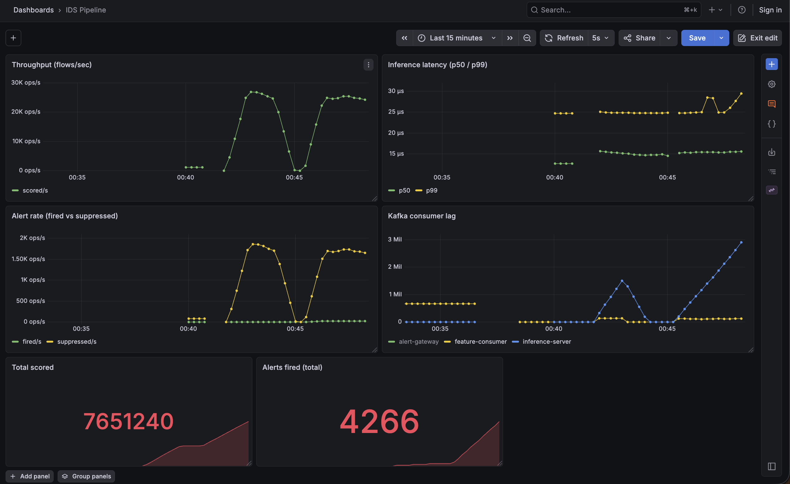

# Real-Time Distributed Intrusion Detection

A production-grade, real-time network intrusion detection system: a C++ hot-path
that parses packets into flows, a Kafka streaming backbone, an ONNX-served
XGBoost model, alert deduplication + a gRPC alert stream, full observability, and
a Kubernetes deployment with event-driven autoscaling.

It started as an offline ML comparison study on the UNSW-NB15 dataset
(LR / MLP / Random Forest / XGBoost) and was rebuilt into a streaming system that
scores live traffic.

## Architecture

```
 pcap / live traffic
        │
        ▼
 flow_extractor (C++, libpcap)  ──►  Kafka: raw-flows
                                          │
                                          ▼
                            feature_consumer (C++)  ──►  Kafka: model-ready-features
                                                              │
                                                              ▼
                                        inference_server (C++, ONNX Runtime)
                                            │   └─ Redis (alert dedup, TTL)
                                            ▼
                                        Kafka: scored-flows ──► alert_gateway (gRPC) ──► clients
                                            │
                          Prometheus ◄──────┘ /metrics  ──►  Grafana dashboards
```

Everything is containerized and deployable to Kubernetes (kind) via Helm, with
KEDA autoscaling the inference service on Kafka consumer lag.

## Highlights (single core, Apple Silicon)

| Stage | Result |
|-------|--------|
| Flow extraction (libpcap → 40 features) | **4.2M packets/sec** (~2.2 GB/s) |
| Kafka pipeline (producer + consumer) | **~80k msg/sec** |
| ONNX inference (batch 64) | **90k flows/sec, p50 ~11 µs / p99 ~17 µs** |
| XGBoost → ONNX parity | **100% label match** (max prob diff 5e-7) vs native |
| Alert deduplication (Redis) | **95% noise reduction** (1,591 → 79 alerts) |
| Train/serve skew check | 0 false positives / 20,762 normal flows; 100% of alerts on the documented attacker subnet |

Validated against the real UNSW-NB15 capture; header fields are byte-exact vs
`tcpdump`.

## Live dashboard



Real-time Grafana view of the running pipeline: end-to-end throughput, inference
latency percentiles (p50/p99), alerts fired vs. suppressed by the Redis dedup
layer, and Kafka consumer lag (the backpressure signal KEDA autoscales on). The
sawtooth is pcap replay traffic. Reproduce it live with the replay loop in
[docs/SETUP.md](docs/SETUP.md).

## Tech stack

- **C++17** — libpcap, librdkafka, ONNX Runtime, hiredis, gRPC/Protobuf, prometheus-cpp (built with CMake + vcpkg)
- **Streaming / data** — Apache Kafka (KRaft), Redis
- **ML** — XGBoost (Python) exported to ONNX, served from C++
- **Ops** — Docker, Helm, KEDA, kind (Kubernetes), Prometheus, Grafana, GitHub Actions

## Repository layout

```
cpp/              C++ services (extractor, feature consumer, inference server, alert gateway) + CMake
infra/            docker-compose, Helm chart (infra/helm/ids), Prometheus/Grafana config
scripts/          export_onnx.py (train + export model), alert_client.py (gRPC test client)
src/              Python preprocessing + the original model-benchmarking study
notebooks/        EDA + model notebooks
docs/             PLAN.md (roadmap+progress), DECISIONS.md (design rationale), SETUP.md (runbook)
```

## Quickstart

Full build/run/deploy instructions are in **[docs/SETUP.md](docs/SETUP.md)**. In short:

```bash
# infra (Kafka, Redis, Prometheus, Grafana)
docker compose -f infra/docker-compose.yml up -d
bash infra/create-topics.sh

# build the C++ services (vcpkg + CMake)
cmake -B cpp/build -S cpp -DCMAKE_TOOLCHAIN_FILE=$VCPKG_ROOT/scripts/buildsystems/vcpkg.cmake -DCMAKE_BUILD_TYPE=Release
cmake --build cpp/build

# train + export the model
.venv/bin/python scripts/export_onnx.py

# run the pipeline (see docs/SETUP.md for the full multi-service flow)
KAFKA_BROKERS=localhost:9092 ./cpp/build/flow_extractor data/1.pcap
```

Kubernetes deploy (kind + Helm + KEDA) and the live Grafana dashboard are covered
in [docs/SETUP.md](docs/SETUP.md).

## Benchmarks

Single core, Apple Silicon, Release (`-O3`), best-of-3. Each stage is measured in
isolation so the number reflects that component, not the harness around it.

| Stage | Result |
|-------|--------|
| Flow extraction (libpcap parse → 40 features) | **4.19M packets/sec** (2.22 GB/s) |
| Kafka producer (pcap → Kafka) | **~74k msg/sec** |
| Feature consumer (encode → model-ready) | **~80k msg/sec** |
| ONNX inference — batch 64 | **90,139 flows/sec** · p50 10.8 µs / p99 16.6 µs |
| ONNX inference — batch 128 | 92,526 flows/sec · p99 15.4 µs |
| XGBoost → ONNX parity | **100% label match** (max prob diff 4.8e-7, 55,945 rows) |
| Alert dedup (Redis) | **95% noise reduction** (e.g. 1,591 → 79 alerts on one pcap pass) |

### Reproduce

```bash
# Release build (optimized) — separate dir from the default debug build
cmake -B cpp/build-release -S cpp \
  -DCMAKE_TOOLCHAIN_FILE=$VCPKG_ROOT/scripts/buildsystems/vcpkg.cmake \
  -DCMAKE_BUILD_TYPE=Release
cmake --build cpp/build-release

# Infra is only needed for the Kafka producer/consumer/dedup benchmarks
docker compose -f infra/docker-compose.yml up -d && bash infra/create-topics.sh
```

```bash
# 1. Flow extraction — pure parse + aggregate, no Kafka (run 3x, take the best)
time ./cpp/build-release/flow_extractor data/1.pcap

# 2. Kafka producer — pcap -> Kafka
time KAFKA_BROKERS=localhost:9092 ./cpp/build-release/flow_extractor data/1.pcap

# 3. Feature consumer — prints sustained msg/sec; Ctrl-C once it's steady
KAFKA_BROKERS=localhost:9092 ./cpp/build-release/feature_consumer

# 4. ONNX inference — model only, no Kafka/Redis (args: model batch iters)
./cpp/build-release/bench_inference models/xgboost_intrusion.onnx 64
./cpp/build-release/bench_inference models/xgboost_intrusion.onnx 128

# 5. Alert dedup — flush Redis first, read the fired/suppressed summary on shutdown
docker exec redis redis-cli FLUSHALL
KAFKA_BROKERS=localhost:9092 ./cpp/build-release/inference_server   # Ctrl-C to print summary
```

## Documentation

- **[docs/PLAN.md](docs/PLAN.md)** — phased roadmap + a dated progress log of everything built.
- **[docs/DECISIONS.md](docs/DECISIONS.md)** — architecture decisions (with alternatives + rationale) and the notable engineering challenges + fixes.
- **[docs/SETUP.md](docs/SETUP.md)** — prerequisites, build, run, observability, k8s deploy, reproduction.

## Status

Core system (Phases 1–5) complete: C++ flow extractor → Kafka streaming → ONNX
inference + dedup + gRPC alerts → Prometheus/Grafana observability → Kubernetes
deployment + CI. Optional tracks (a JAX/TF-Serving deep-learning path; distributed
hyperparameter optimization) are scoped in [docs/PLAN.md](docs/PLAN.md).
